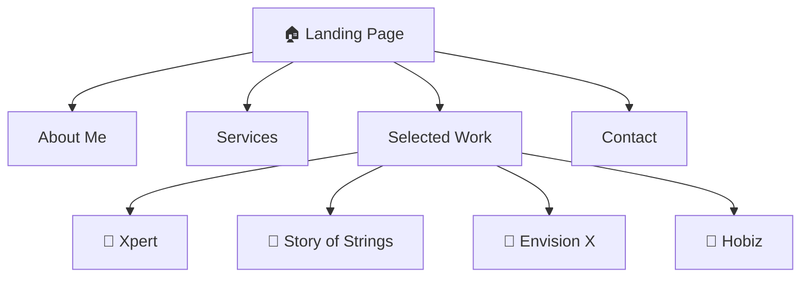
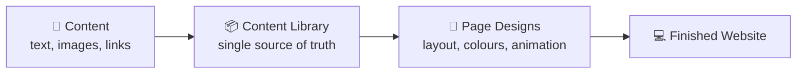

# Sakshi Kejriwal — Portfolio

This is my personal portfolio. I'm **Sakshi Kejriwal**, a digital marketing strategist and
creative, and this site brings my professional work, in-depth case studies, and creative
projects together in one polished, interactive place.

> Built once, runs everywhere — it works in a web browser today, and the same code can
> become an iPhone or Android app later if I ever need it to.

---

## 📖 What is this?

This repository holds the complete source code for my portfolio website — think of it as the
**blueprint** a builder uses: all the instructions a computer needs to assemble the finished
site.

My portfolio has two kinds of pages:

- **Landing page** — the main page visitors see first. It introduces me, lists my services,
  highlights my best work, and shows how to get in touch.
- **Case study pages** — one per project, each telling the full story of a specific piece of
  work in detail.

### The pages at a glance



---

## 🧩 How it's put together (in plain English)

I built the project so that **the words and pictures stay separate from the design and
layout**. That was a deliberate choice — it means I can update the content later (even
through an easy-to-use online editor) without anyone having to touch the design code.



Right now the content lives in files inside the project. Later it can be swapped for an
online editor (a "CMS" — content management system), and because of this separation **none
of the design code has to change**.

---

## 🛠️ What it's built with

You don't need to know any of this to use the site — I've listed it for developers and
curious readers.

| Tool | What it does, in simple terms |
| --- | --- |
| **Expo + React Native** | The framework — lets one set of code run on web *and* mobile. |
| **Expo Router** | Handles moving between pages (the landing page, each case study). |
| **TypeScript** | The programming language — a safer version of JavaScript. |
| **Reanimated** | Powers the smooth scrolling, hover effects, and animations. |

---

## 📁 Project layout

A quick map of the main folders, so you know where things live:

| Folder | What's inside |
| --- | --- |
| `app/` | The actual pages of the site. |
| `src/components/` | Reusable building blocks (buttons, cards, the navigation bar…). |
| `src/data/` | All the content — my text, project details, and the "content library". |
| `src/theme/` | The design system — colours, fonts, and spacing rules. |
| `assets/images/` | Photos, logos, and videos used across the site. |

---

## 🚀 Running it on your own computer

For developers, or anyone curious to see the site run locally.

**1. Install the toolkit** (one-time setup — downloads everything the project needs):

```bash
npm install
```

**2. Start the site:**

```bash
npx expo start
```

Then press **`w`** in the terminal to open it in your web browser.

**3. Build the final website** (creates a ready-to-publish version in a `dist` folder):

```bash
npx expo export --platform web
```

---

## 🌐 Status

The site is content-complete and ready to be published online (e.g. on Vercel). My next step
is connecting an online content editor so I can update the portfolio without touching code.
